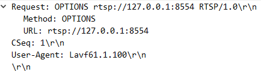
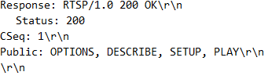
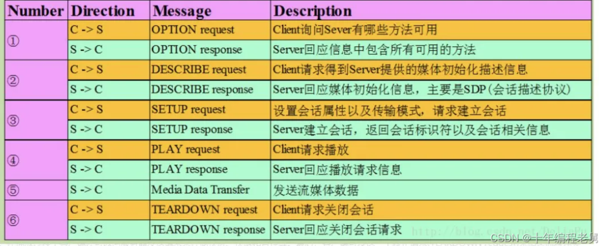

# RTP/RTCP/RTSP

RTSP协议：负责服务器与客户端之间的请求与响应。

RTP协议： 负责服务器与客户端之间传输媒体数据。

RTCP协议：负责提供有关RTP传输质量的反馈，就是确保RTP传输的质量。

三者的关系： RTSP并不会发送媒体数据，只是完成服务器和客户端之间的信令交互，RTP协议负责媒体数据传输，RTCP负责RTP数据包的监视和反馈。RTP和RTCP并没有规定传输层的类型，可以选择udp和tcp。RTSP的传输层则要求是基于tcp。

## RTSP协议建立连接

**RTSP客户端请求格式**

~~~
method url vesion\r\n
CSeq: x\r\n
xxx\r\n
...
\r\n
~~~

method：方法，表明这次请求的方法，rtsp定义了很多方法，稍后介绍
url：格式一般为rtsp://ip:port/session，ip表主机ip，port表端口好，如果不写那么就是默认端口，rtsp的默认端口为554，session表明请求哪一个会话
version：表示rtsp的版本，现在为RTSP/1.0
CSeq：序列号，每个RTSP请求和响应都对应一个序列号，序列号是递增的

**RTSP服务端响应格式**

~~~
vesion 200 OK\r\n
CSeq: x\r\n
xxx\r\n
...
\r\n
~~~

version：表示rtsp的版本，现在为RTSP/1.0
CSeq：序列号，这个必须与对应请求的序列号相同

**一个完整的交互过程**：

## RTP和RTCP协议传输数据

RTP报文用于传送媒体数据（如音频和视频），它由 RTP报头和数据两部分组成，RTP数据部分称为有效载荷(payload)；RTCP报文用于传送控制信息，以实现协议控制功能。RTP报文和RTCP 报文将作为下层协议的数据单元进行传输。如果使用UDP，则RTP报文和RTCP报文分别使用两个相邻的UDP端口，RTP报文使用低端口，RTCP报文使用高端口。如果使用TCP协议，RTP报文和RTCP报文可以合并，放在一个数据单元中一起传送，控制信息在前，媒体数据在后。通常，RTP是由应用程序实现的。

**RTP报头格式**

~~~c++
struct RtpHeader
{
    /* byte 0 */
    uint8_t csrcLen : 4;// CC：CSRC计数器，占4位，指示CSRC 标识符的个数。
    uint8_t extension : 1;// X：占1位，如果X=1，则在RTP报头后跟有一个扩展报头。
    uint8_t padding : 1;// P：填充标志，占1位，如果P=1，则在该报文的尾部填充一个或多个额外的八位组，它们不是有效载荷的一部分。
    uint8_t version : 2;// V：RTP协议的版本号，占2位，当前协议版本号为2。

    /* byte 1 */
    uint8_t payloadType : 7;// PT：有效载荷类型，占7位，用于说明RTP报文中有效载荷的类型，如GSM音频、JPEM图像等。
    uint8_t marker : 1;// M：标记，占1位，不同的有效载荷有不同的含义，对于视频，标记一帧的结束；对于音频，标记会话的开始。

    /* bytes 2,3 */
    uint16_t seq;//序列号：占16位，用于标识发送者所发送的RTP报文的序列号，每发送一个报文，序列号增1。接收者通过序列号来检测报文丢失情况，重新排序报文，恢复数据。

    /* bytes 4-7 */
    uint32_t timestamp;//占32位，时戳反映了该RTP报文的第一个八位组的采样时刻。接收者使用时戳来计算延迟和延迟抖动，并进行同步控制。

    /* bytes 8-11 */
    uint32_t ssrc;//占32位，用于标识同步信源。该标识符是随机选择的，参加同一视频会议的两个同步信源不能有相同的SSRC。

   /*标准的RTP Header 还可能存在 0-15个特约信源(CSRC)标识符
   
   每个CSRC标识符占32位，可以有0～15个。每个CSRC标识了包含在该RTP报文有效载荷中的所有特约信源

   */
};
~~~

## **H264介绍**

H264压缩技术主要采用了以下几种方法对视频数据进行压缩：

- 帧内预测压缩，解决的是空域数据冗余问题。
- 帧间预测压缩（运动估计与补偿），解决的是时序数据冗徐问题。
- 整数离散余弦变换（DCT），将空间上的相关性变为频域上无关的数据然后进行量化。

经过压缩后的帧为：I帧，P帧，B帧。
I帧：关键帧，采用帧内压缩技术。
P帧：向前参考帧，在压缩时，只参考前面已经处理的帧。采用帧间压缩技术。
B帧：双向参考帧，在压缩时，它即参考前而的帧，又参考它后面的帧。采用帧间压缩技术。
IDR帧：IDR帧是一种特殊的I帧，当有了IDR帧，解码器收到IDR帧时，就会将缓冲区的数据清空，找到第一个IDR帧，重新编码。I和IDR帧都属于帧内预测，在编码和解码中为了方便，首个I帧和其他I帧区别开，把第一个I帧叫IDR，这样方便控制编码和解码流程。IDR帧必须是一个I帧，但I帧不一定是IDR帧。当IDR帧出现时编码器可以清除全部参考帧，代表一个全新的序列，新的GOP开始了。I帧有被跨帧参考的可能IDR帧没有。
GOP（Group of Pictures，图像组）是指一组连续的帧序列，通常从一个I帧（关键帧）开始，后面跟随多个P帧和B帧。

h264编码中NAL（Network Abstraction Layer，网络抽象层）和VCL（Video Coding Layer，视频编码层）是两个核心组成部分。VCL是H.264中负责视频数据编码的部分，它处理原始视频帧的压缩和编码。NAL是H.264中负责封装和传输编码数据的部分，它将VCL生成的切片数据封装成适合传输或存储的格式。NAL将VCL生成的切片数据封装成**NALU（NAL Unit）**。NALU是H.264中数据传输的基本单位。

在H264（AVC）编码标准中，**SPS（Sequence Parameter Set，序列参数集）**和**PPS（Picture Parameter Set，图像参数集）**是两种重要的非VCL的NALU，它们包含了视频序列和图像的全局参数信息。
**SPS**包含视频序列的全局参数信息，这些参数通常在整个视频序列中保持不变，如编码档次(profile)、级别(level)、分辨率、帧率、比特深度、GOP结构。SPS是解码器初始化的关键，解码器需要先解析SPS才能正确解码后续的视频数据。
**PPS**包含与单个图像（帧）相关的参数信息。一个视频序列可以有多个PPS，每个PPS对应不同的图像参数，如熵编码方式、切片组数量、量化参数等。PPS提供了帧级的编码参数，解码器需要根据PPS中的信息解码每一帧。
**SEI**补充增强信息，用于传递额外的元数据（如时间戳、版权信息）。

- SPS提供视频序列的全局参数，通常在视频流的开头传输，且在整个序列中保持不变。
- PPS提供单个图像的编码参数，可能在视频流中多次传输，尤其是在参数发生变化时。
- SPS和PPS共同协作，确保解码器能够正确初始化和解码视频流。

## **H264码流进行RTP封装**

H264码流是由一个一个NALU组成，每个NALU之间使用00 00 00 01或00 00 01分隔开，每个NALU的第一次字节都有特殊的含义。第一个字节格式如下：

1. F(forbiden):禁止位，占用NAL头的第一个位，当禁止位值为1时表示语法错误；
2. NRI:参考级别，占用NAL头的第二到第三个位；值越大，该NAL越重要。
3. Type:Nal单元数据类型，也就是标识该NAL单元的数据类型是哪种，占用NAL头的第四到第8个位；

常用的NALU_type：
~~~
0x06 (0 00 00110) SEI      type = 6
0x67 (0 11 00111) SPS      type = 7
0x68 (0 11 01000) PPS      type = 8

0x65 (0 11 00101) IDR      type = 5
0x65 (0 10 00101) IDR      type = 5
0x65 (0 01 00101) IDR      type = 5
0x65 (0 00 00101) IDR      type = 5

0x61 (0 11 00001) I帧      type = 1
0x41 (0 10 00001) P帧     type = 1
0x01 (0 00 00001) B帧     type = 1
~~~

每个RTP包都有固定的头部和载荷，在对NALU进行RTP打包发送时有以下三种方式：

- 单NALU打包： 一个RTP包包含一个完整的NALU。
- 聚合打包：对于较小的NALU，一个RTP包可包含多个完整的NALU。
- 分片打包：对于较大的NALU，一个NALU可以分为多个RTP包发送。

在单NALU打包时只需将完整的NALU内容复制到RTP载荷中即可。

在分片打包时将完整的NALU分为若干片，由于RTP头部是固定的，那么只能在RTP载荷中去添加额外信息来说明这个RTP包是表示同一个NALU如果是分片打包的话，那么在RTP载荷开始有两个字节的信息，然后再是NALU的内容

第一个字节位FU Indicator其格式如下：

高三位：与NALU第一个字节的高三位相同。Type：28，表示该RTP包为一个分片。

第二个字节位FU Header，其格式如下：

S：标记该分片打包的第一个RTP包。E：比较该分片打包的最后一个RTP包。Type：NALU的Type

## AAC音频码流进行RTP封装

AAC音频有两种：

- ADIF(Audio Data Interchage Format)，音频数据交换格式：只有一个统一的头，必须得到所有数据后解码，适用于本地文件。
- ADTS(Audio Data Transport Stream)，音视数据传输流：每一帧都有头信息，任意帧解码，适用于传输流。

在传输中主要采用ADTS。ADTS的结构是每一帧都带adts头部，头部后面跟着是aac的原始流（aac es），结构如下：

adts的头部一共有15个字段，共7bytes，如果有校验位则会在尾部增加2bytesCRC校验。具体如下：

具体例子如下：

对应数值如下：

AAC的RTP打包方式就是将ADTS帧取出ADTS头部，取出AAC数据，每帧数据封装成一个RTP包。**需要注意的是，并不是将AAC数据直接拷贝到RTP的载荷中。AAC封装成RTP包，在RTP载荷中的前四个字节是有特殊含义的，然后再是AAC数据，**如下图所示。

其中RTP载荷的一个字节为0x00，第二个字节为0x10。第三个字节和第四个字节保存AAC Data的大小，最多只能保存13bit，第三个字节保存数据大小的高八位，第四个字节的高5位保存数据大小的低5位。

~~~c
rtpPacket->payload[0] = 0x00;
rtpPacket->payload[1] = 0x10;
rtpPacket->payload[2] = (frameSize & 0x1FE0) >> 5; //高8位
rtpPacket->payload[3] = (frameSize & 0x1F) << 3; //低5位
~~~

